# AMD_AI_Robotic_Challenge
## Challenge overview
AMD - Kria KR260 board
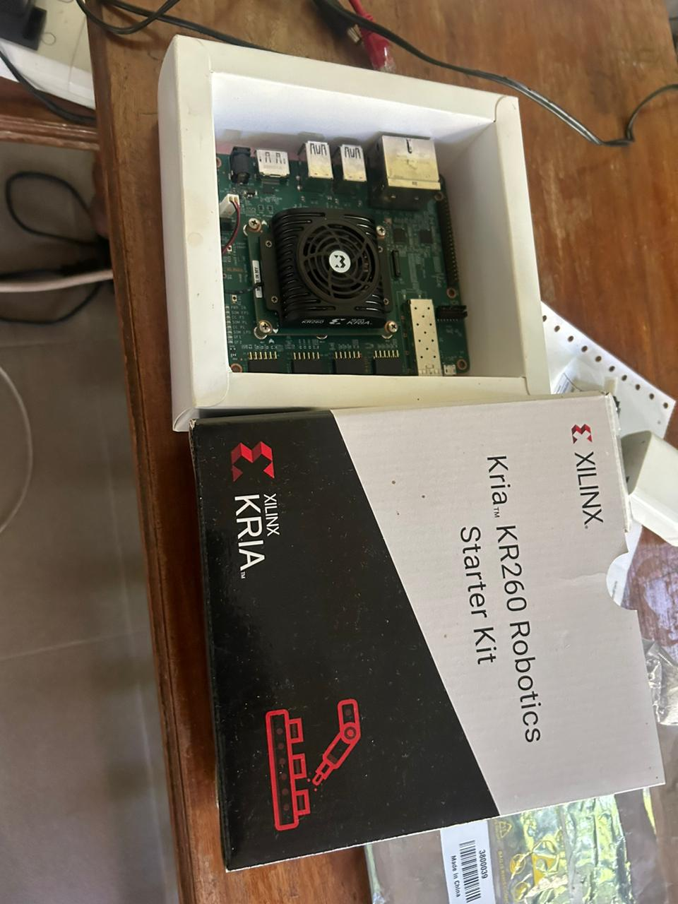
AI - using vitis AI and using the PYNQ
robotic challenge - ROS 2 


### Booting ubuntu in the board

###  Connecting the board to pc
```
sudo gtkterm
```
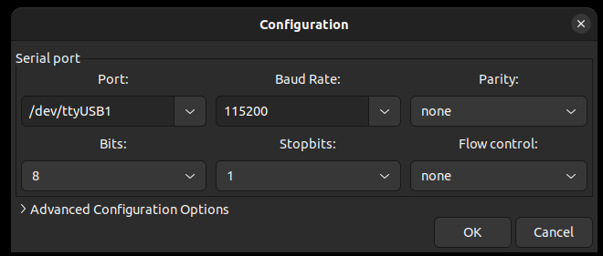

port may be vary depending on the port you connected with PC

connect all the ports to the board then connect to the power

connected successfully
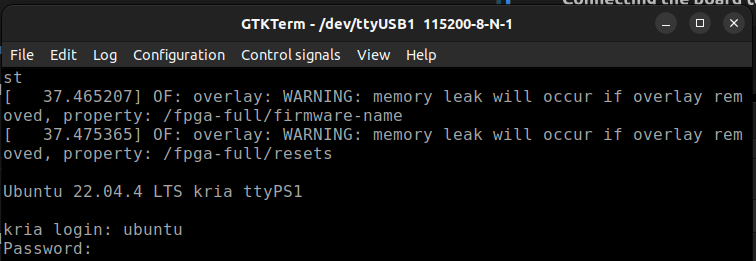

upgrade to the latest version
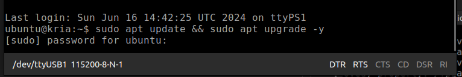
```
sudo apt update & sudo apt upgrade -y python
```

we count not connect the monitor using the display port, we tried to connect using the remote desktop
 ### find the ip address of the board
 ```
sudo ifconfig -a
 ```
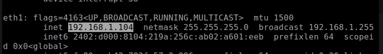

### On the Kria KR260:
```
sudo apt update
sudo apt install tightvncserver
```
```
vncserver
```
You'll be prompted to set a password the first time you run it.
### On the Host Machine:

Install a VNC Viewer:
```
sudo apt install tigervnc-viewer
```
Connect to the VNC Server:
```
vncviewer 192.168.1.104:1
```


type the password to connect

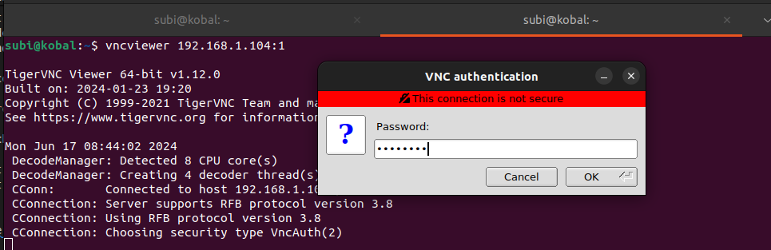


successfully connect to the VNC Server
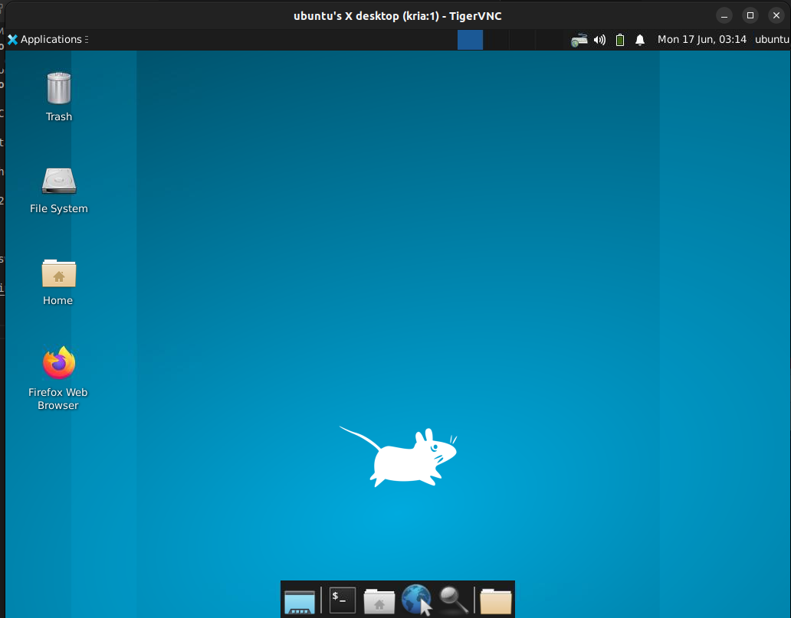

we installed the VScode in the board
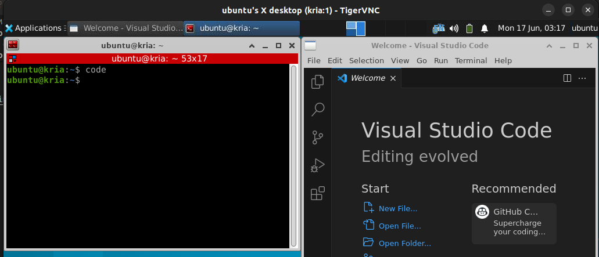

how to run the firefox
```
xhost +local:$(whoami)
sudo -E firefox
```
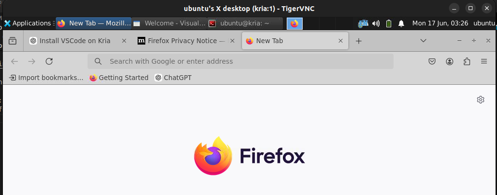


### sending c++ file to board  from host machine

write the c++ code in input.cpp

and source main.csh
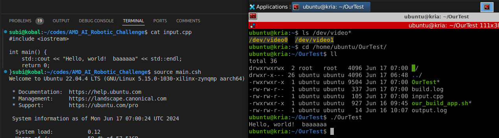

### how to connect the web camera to the board
connect the web camera to the upper right usb port of board,
copy the check_camera.cpp to input.cpp,
source main.csh

in vnc,
```
cd /home/ubuntu/Ourtest
./Ourtest
```

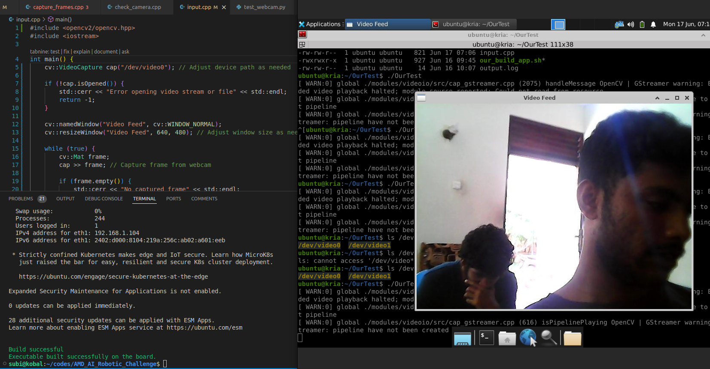

second time this is not working
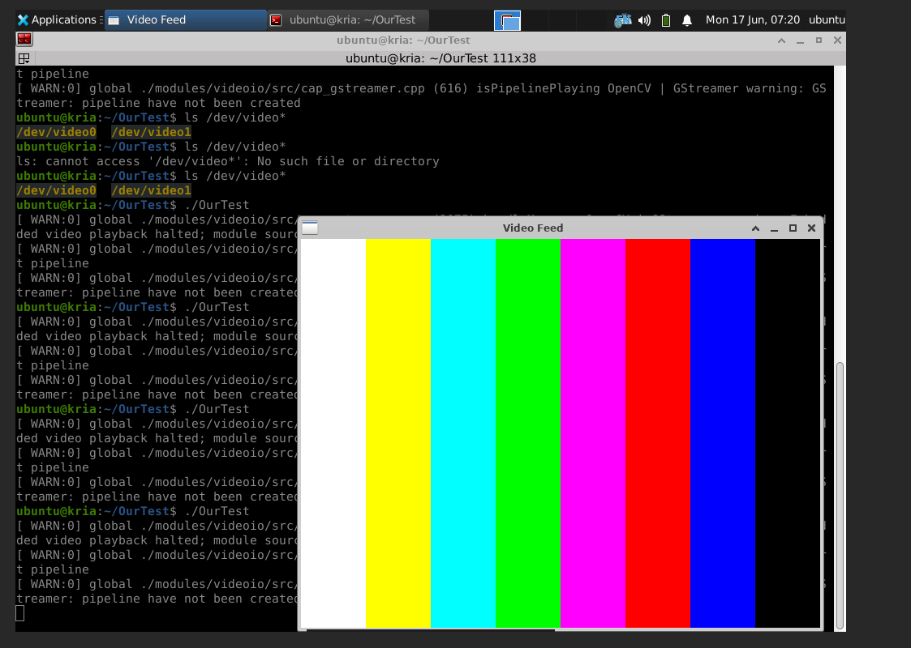

### lets try the capturing frames
1st time success

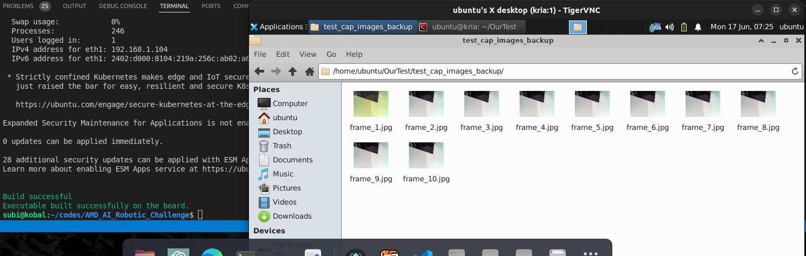

2nd time failure

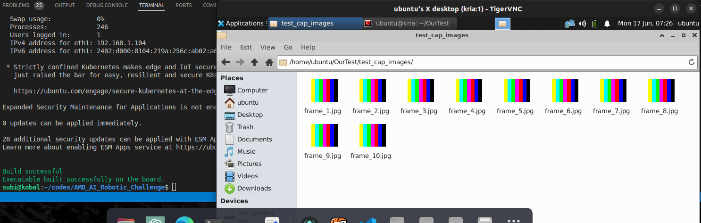