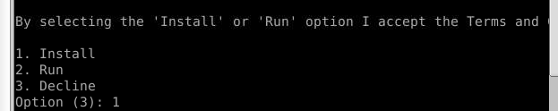

# AMD_AI_Robotic_Challenge

## Challenge Overview

### AMD - Kria KR260 Board


### AI - Using Vitis AI and PYNQ
### Robotic Challenge - ROS 2

## Booting Ubuntu on the Board

### Connecting the Board to PC

1. Open terminal and run:
    ```bash
    sudo gtkterm
    ```
    
    Port may vary depending on the port connected to the PC.

2. Connect all the ports to the board, then connect to the power. The board should be successfully connected.
    

3. Upgrade to the latest version:
    ```bash
    sudo apt update && sudo apt upgrade -y python
    ```
    

### Finding the IP Address of the Board

1. Run:
    ```bash
    sudo ifconfig -a
    ```
    

### Setting Up VNC Server on Kria KR260

1. On the Kria KR260:
    ```bash
    sudo apt update
    sudo apt install tightvncserver
    vncserver
    ```
    You'll be prompted to set a password the first time you run it.

2. On the Host Machine:
    ```bash
    sudo apt install tigervnc-viewer
    vncviewer 192.168.1.104:1
    ```

### Debugging Information

Check the IP address of the board:
```bash
ifconfig -a
# It should look like this, else reboot it:
eth1: flags=4163<UP,BROADCAST,RUNNING,MULTICAST>  mtu 1500
        inet 192.168.1.104  netmask 255.255.255.0  broadcast 192.168.1.255

If not, after reboot:
```bash
vncserver
```
Type the password to connect:

Successfully connected to the VNC Server:


### Installing and Running Applications on the Board

- **VSCode Installation**:
    

- **Running Firefox**:
    ```bash
    xhost +local:$(whoami)
    sudo -E firefox

    # You can simply run (automated):
    run_firefox
    ```
    

## Accessing the Board Using Web

1. Install DWS control (only on the board):
    ```bash
    https://www.dwservice.net/en/download.html
    ```

    file will be downloaded in /root/Download ( you have to be su )
2. Go to the directory:
    ```bash
    chmod +x dwagent.sh
    ./dwagent.sh
    ```

    
3. After installation, run again:
    ```bash
    ./dwagent.sh
    ```
4. Find the username and password, and login using:
    

### how to access using internet connection

```
https://access.dwservice.net/login.dw?localeid=en#
```
use the username and password 
 #### check theses things
 make sure that there is a file called update_repo.sh inside /home/ubuntu/OurTest/ is not using note editor make a file in the  /home/ubuntu/OurTest/ - you can copy from this_repo/basic_script/update_repo.sh

### How to share file using internet connection
#### in your host machine
put your file in **this_repo/kriaKR260Board/** run the **this_repo/basic_scripts/submit_changes.sh** this will submit your files to https://github.com/CroosJJSE/kriaKR260Board
#### in board ( web terminal )
just run the **update_repo.sh**


### Sending C++ File to Board from Host Machine

1. Write the C++ code in `input.cpp`.
2. Source `main.csh`:
    

### Connecting the Web Camera to the Board

1. Connect the web camera to the upper right USB port of the board.
2. Copy `check_camera.cpp` to `input.cpp`, source `main.csh`.
3. In VNC, run:
    ```bash
    cd /home/ubuntu/Ourtest
    ./Ourtest
    ```
    
    Note: The second time this may not work.
    

### Capturing Frames

1. First time success:
    
2. Second time failure:
    

## Installation of ROS2

1. Set up your ROS2 environment:
    ```bash
    source /opt/ros/humble/setup.bash
    ```

2. Launch the turtle simulator:
    ```bash
    ros2 run turtlesim turtlesim_node
    ```

3. Control the turtle:
    ```bash
    ros2 run turtlesim turtle_teleop_key
    ```
    


## Face Recognition ROS 2 Package

### Setup Instructions

1. **Create ROS 2 Workspace**:
    ```bash
    mkdir -p ~/ros2_ws/src
    cd ~/ros2_ws
    source /opt/ros/humble/setup.bash
    ```

2. **Create Face Recognition Package**:
    ```bash
    cd ~/ros2_ws/src
    ros2 pkg create --build-type ament_cmake face_recognition_pkg
    ```

3. **Implement Face Recognition Node**:
    - Create `src` directory and write the face recognition node:
        ```bash
        cd ~/ros2_ws/src/face_recognition_pkg
        mkdir src
        cd src
        code face_recognition_node.cpp
        ```
    - Paste the face recognition node code into `face_recognition_node.cpp`.
    - Download Haar Cascade XML file:
        ```bash
        mkdir -p ~/ros2_ws/src/face_recognition_pkg/resources
        cd ~/ros2_ws/src/face_recognition_pkg/resources
        wget https://raw.githubusercontent.com/opencv/opencv/master/data/haarcascades/haarcascade_frontalface_default.xml
        ```

4. **Update CMakeLists.txt and package.xml**:
    ```bash
    cd ~/ros2_ws/src/face_recognition_pkg
    code CMakeLists.txt
    code package.xml
    ```
    Update the file from the repository.

5. **Build the ROS 2 Workspace**:
    ```bash
    cd ~/ros2_ws
    source /opt/ros/humble/setup.bash
    colcon build --packages-select face_recognition_pkg
    ```

6. **Run the Face Recognition Node**:
    ```bash
    source ~/ros2_ws/install/setup.bash
    ros2 run face_recognition_pkg face_recognition_node
    ```
    See the output:
    ```bash
    ros2 run image_view image_view --ros-args -r image:= /webcam/face_recognition
    ```
    

## Running ORBSLAM3 on PC without ROS2

1. Download ORBSLAM3 from [GitHub](https://github.com/UZ-SLAMLab/ORB_SLAM3) and run using EuRoc Dataset:

make sure that you have the /workspace/MH_01_easy folder which has the EUROC dataset

```bash
    ./Examples/Monocular/mono_euroc ./Vocabulary/ORBvoc.txt Examples/Monocular/EuRoC.yaml /workspace/MH_01_easy Examples/Monocular/EuRoC_TimeStamps/MH01.txt
```


2. Connect your mobile phone as the webcam to the PC to map your home. Create two new scripts in the `_ORBSLAM_no_ROS` folder.
    - For compiling:
```
g++ -c mono_phone.cc -o mono_phone.o \
    -I/home/subi/codes/AMD_AI_Robotic_Challenge/ORB_SLAM3 \
    -I/home/subi/codes/AMD_AI_Robotic_Challenge/ORB_SLAM3/include \
    -I/home/subi/codes/AMD_AI_Robotic_Challenge/ORB_SLAM3/include/CameraModels \
    -I/home/subi/codes/AMD_AI_Robotic_Challenge/ORB_SLAM3/eigen \
    -I/home/subi/codes/AMD_AI_Robotic_Challenge/ORB_SLAM3/Thirdparty/Sophus \
    -I/home/subi/codes/AMD_AI_Robotic_Challenge/ORB_SLAM3/Thirdparty/g2o \
    -I/home/subi/codes/AMD_AI_Robotic_Challenge/ORB_SLAM3/Thirdparty \
    -I/usr/local/include/opencv4 \
    -O3 -march=native -std=c++14

```
- For linking:
```bash
g++ mono_phone.o -o mono_phone \
    -L/home/subi/codes/AMD_AI_Robotic_Challenge/ORB_SLAM3/lib \
    -L/usr/local/lib \
    -lORB_SLAM3 \
    -lpangolin \
    -lopencv_core \
    -lopencv_imgproc \
    -lopencv_highgui \
    -lopencv_features2d \
    -lopencv_calib3d \
    -lopencv_ml \
    -lopencv_video \
    -lopencv_objdetect \
    -lopencv_photo \
    -lopencv_videoio \
    -lGL \
    -lGLEW

```

```
export LD_LIBRARY_PATH=/home/subi/codes/AMD_AI_Robotic_Challenge/ORB_SLAM3/lib:$LD_LIBRARY_PATH

```
- for execution 
```
./mono_phone /home/subi/codes/AMD_AI_Robotic_Challenge/ORB_SLAM3/Vocabulary/ORBvoc.txt ./phone_camera.yaml

```


## Cross-Compiling for AArch64

### Prerequisites

Ensure that the following tools are installed on your Ubuntu host machine:
- CMake
- gcc-aarch64-linux-gnu
- g++-aarch64-linux-gnu

You can install the cross-compiler toolchain using the following command:
```
sudo apt-get update
sudo apt-get install gcc-aarch64-linux-gnu g++-aarch64-linux-gnu
```

### Project Structure

```
your_project/
├── CMakeLists.txt
├── aarch64-toolchain.cmake
├── src/
│   └── main.cpp
├── build/
│   └── myproject  # Important file to keep
├── clean_build.sh
└── main.sh
```

### Files Explanation

- **CMakeLists.txt**: CMake configuration file.
- **aarch64-toolchain.cmake**: Toolchain file for cross-compiling.
- **src/**: Directory containing source code files.
- **build/**: Directory where the project will be built.
- **clean_build.sh**: Script to clean up unwanted files after the build.
- **main.sh**: Main script to perform the build and clean-up.

### Usage


#### 1. Configure and Cross-Compile the Project

Run the `main.sh` script to configure and cross-compile the project:
```bash
chmod +x main.sh
./main.sh
```

The script performs the following steps:
1. Creates a `build` directory.
2. Configures the project with CMake using the specified toolchain file.
3. Compiles the project.
4. Moves the important `build/myproject` file to the parent directory.
5. Cleans up the build directory by removing all other generated files.
```

You can copy the above content and paste it directly into your `README.md` file on GitHub.